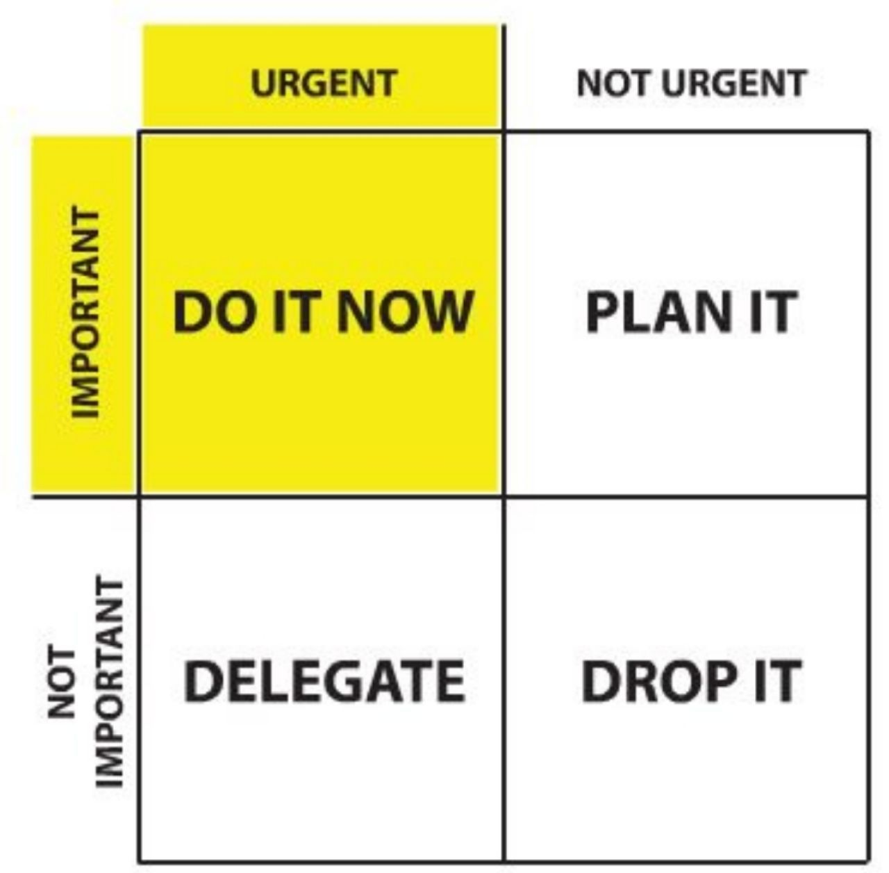
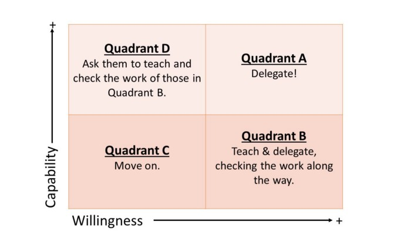

# Guida Galattica per Farmacisti
 


# Git

Usare git è fondamentale per la collaborazione sulla configurazione.

- [Basi di git](https://www.atlassian.com/git)
  - commit
  - merge
  - branch
  - pull request
  - git flow
- [git rebase](https://git-rebase.io/)
- [Oh Shit! Git!](https://ohshitgit.com/)
- [Git BFG per rimuovere chiavi o password da una repo](https://rtyley.github.io/bfg-repo-cleaner/)
- [Ma io voglio una gui](https://git-scm.com/docs/gitk)

Si consiglia di nominare `stable` come branch principale. Questo a promemoria di come il codice che entra in quel branch _deve_ essere testato.

# Gestione dei segreti

Si consiglia di creare una repository o documento a parte solo per i segreti che vengono usati nel gruppo (password, chiavi, token, ...).

# Agile

[Seguite il manifesto e nulla di più.](https://en.wikipedia.org/wiki/Agile_software_development#The_Manifesto_for_Agile_Software_Development)

Non applicate un framework agile (come SCRUM) solo perché vi sembra semplice e intelligente.
Le persone non sono blocchetti che possono essere disposti a piacimento.
Per questo non si puó semplicemente applicare una metodologia.
La situazione va studiata e ciascun individuo deve essere responsabile e partecipe alla scelta della metodologia da usare.
Questo è un altro motivo per cui le norme di progetto vengono svolte in gruppo.

# Delegazione e pair programming

È bello e consigliato svolgere alcune attività insieme. Si consiglia di prendere in considerazione anche l'attività di delegazione.

Should you do it?


How to delegete.


# Come scelgo il capitolato?

Nella scelta del capitolato bisogna essere sicuri di cosa si sta andando incontro.

Per questo viene fatto uno studio di fattibilità che per essere realizzata è necessario essere realistici e saper rispondere a questi punti.

1. Cosa si aspetta il proponente di ottenere?
2. Come mai interessa loro avere quello che produrrete?
3. Come mai per voi può essere interessante produrlo?
4. Che mercato può esserci per quello che produrrete e per le competenze acquisite?

Siate realistici nella scelta, considerando che tutti dovranno partecipare al progetto.

<hr />

<!--
Da rivedere:

# Disciplina

R e s p o n s a b i l i t à.

## L'individuo

## Il gruppo
# Comunicazioni

## Email

# Email

È consigliato di configurare la mail di gruppo in modo che i messaggi vengano automaticamente inoltrati a tutti i componenti del gruppo.

Gmail permette questo in maniera molto semplice (spiegare davvero?). Si sconsiglia di collegare numeri di telefono o aggiungere l'account su dispositivi Android.

come rispondere...

## Comunicazioni

## Telegram

Gruppo e spam

## Discord

## Slack

Maybe, overkill

# Ambiente di lavoro

## Organizzazione

## Repository

## Ticket / Issue

Segnarsi le cose da fare.
Ordinare per gerarchia e categoria.
Feature -> Task

## GitHub
Issue, progetti, actions...

## Altri sistemi

# Setup tecnici

## Autorizzazioni (git)


# ...

# Versionamento

## Metodo Red Round Robin

## Metodo Bloomsoft

# Documentazione

## Documenti

### LaTeX (markdown?)

### Google Docs

## Analisi dei requisiti

### Tracciamento dei requisiti

### Diagrammi dei casi d'uso

PlantUML vs...

# Framework

cosa sono anche dal punto di vista dell'analisi del progetto e come usarli

# Database

Cosa sono e come usarli e configurarli nel progetto dato che sarebbe bello non perdere dati.

# Test

## Come e cosa

## Unità

## Integrazione

## Sistema

## Accettazione
# Metriche

## Come e cosa

## Perché

## Sonarcloud / Sonarcube

Si consiglia di configurare sonarcloud/sonarcube per verificare il codice in maniera automatica.

# Hosting

## Dominio

## Server

### Cloud

### VPS

### Self-hosted

## Manutenzione

### Chiavi SSH

### Cosa non fare su un server

## Automazione

Github e non

## Docker

container e come tenere pulito

# Simple Design
# Pattern architetturali
# Linguaggi

## Vincoli

## Design Patterns

## Anti-patterns

> singleton in javascript

## Stile

## Linter

## IDE

vim, VSCode...

Linguaggio, editor e compilatori sono irrilevanti davanti ad un'analisi e progettazione scadenti.

Per la scrittura del codice si consiglia di scriverne il meno possibile, ma questo non implica scrivere le variabili con singoli caratteri: è sempre necessaria chiarezza nel codice per rendere comprensibile a tutti — soprattuto a chi leggerá dopo per trovare errori.

Il linguaggio scelto porta con sé pregi e vincoli che vanno considerati in fase di progettazione.

La progettazione deve prevedere ogni singolo aspetto del programma per facilitare la scrittura.


# Proof Of Concept
# Modelli di sviluppo
# Refactor

less is more

# Automation
# Continuous Integration

test test test

# Continuous Delivery

deploy deploy rollback

# Validazione

# Chiavi sparse

## AWS

-->

# Note conclusive

[CC BY-NC-SA 4.0](https://creativecommons.org/licenses/by-nc-sa/4.0/)

```
Copyright (c) 2019-2021, Dorime Chants
All right reserved.

TODO REVISE LICENCE.

THIS SOFTWARE IS PROVIDED BY THE COPYRIGHT HOLDERS AND CONTRIBUTORS "AS IS" AND
ANY EXPRESS OR IMPLIED WARRANTIES, INCLUDING, BUT NOT LIMITED TO, THE IMPLIED
WARRANTIES OF MERCHANTABILITY AND FITNESS FOR A PARTICULAR PURPOSE ARE
DISCLAIMED. IN NO EVENT SHALL <COPYRIGHT HOLDER> BE LIABLE FOR ANY
DIRECT, INDIRECT, INCIDENTAL, SPECIAL, EXEMPLARY, OR CONSEQUENTIAL DAMAGES
(INCLUDING, BUT NOT LIMITED TO, PROCUREMENT OF SUBSTITUTE GOODS OR SERVICES;
LOSS OF USE, DATA, OR PROFITS; OR BUSINESS INTERRUPTION) HOWEVER CAUSED AND
ON ANY THEORY OF LIABILITY, WHETHER IN CONTRACT, STRICT LIABILITY, OR TORT
(INCLUDING NEGLIGENCE OR OTHERWISE) ARISING IN ANY WAY OUT OF THE USE OF THIS
SOFTWARE, EVEN IF ADVISED OF THE POSSIBILITY OF SUCH DAMAGE.
```

